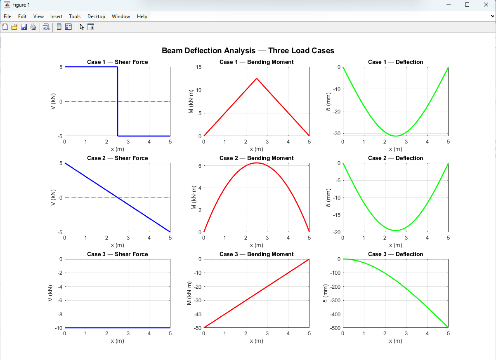

# Beam Deflection Calculator

MATLAB script that calculates and plots shear force, bending moment, and deflection for three structural beam configurations.

## Preview


## Files
- [`Beam_Deflection.m`](Beam_Deflection.m) — main MATLAB script
- [`BeamFigure1.png`](BeamFigure1.png) — output figure

## Cases analyzed
- Simply supported beam with central point load
- Simply supported beam with uniform distributed load
- Cantilever beam with point load at free end

## Theory

| Case | Max Deflection Formula |
|------|----------------------|
| Simply supported + point load | δ = PL³/48EI |
| Simply supported + distributed load | δ = 5wL⁴/384EI |
| Cantilever + point load | δ = PL³/3EI |

## How to run
```matlab
% Set your beam properties at the top of the script
L = 5;      % length (m)
P = 10000;  % point load (N)
w = 2000;   % distributed load (N/m)
E = 200e9;  % Young's modulus (Pa)
% Then run Beam_Deflection.m
```

## Tools
MATLAB R2024a

## Skills demonstrated
Structural analysis • Euler-Bernoulli beam theory • Shear and moment diagrams • MATLAB • Engineering visualization
