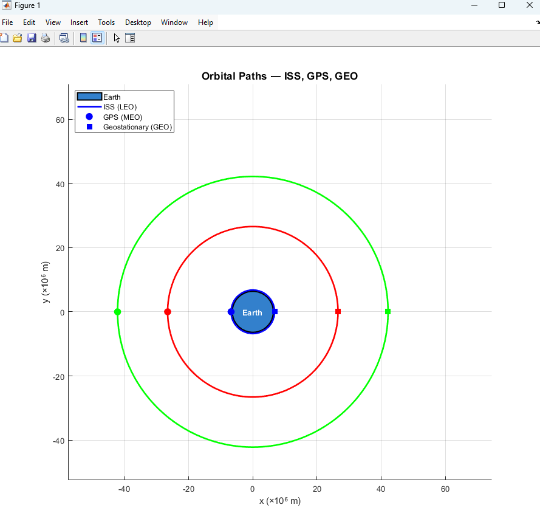
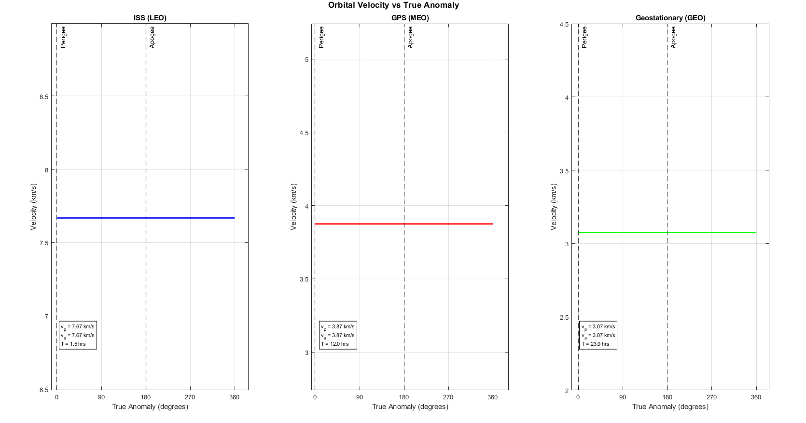
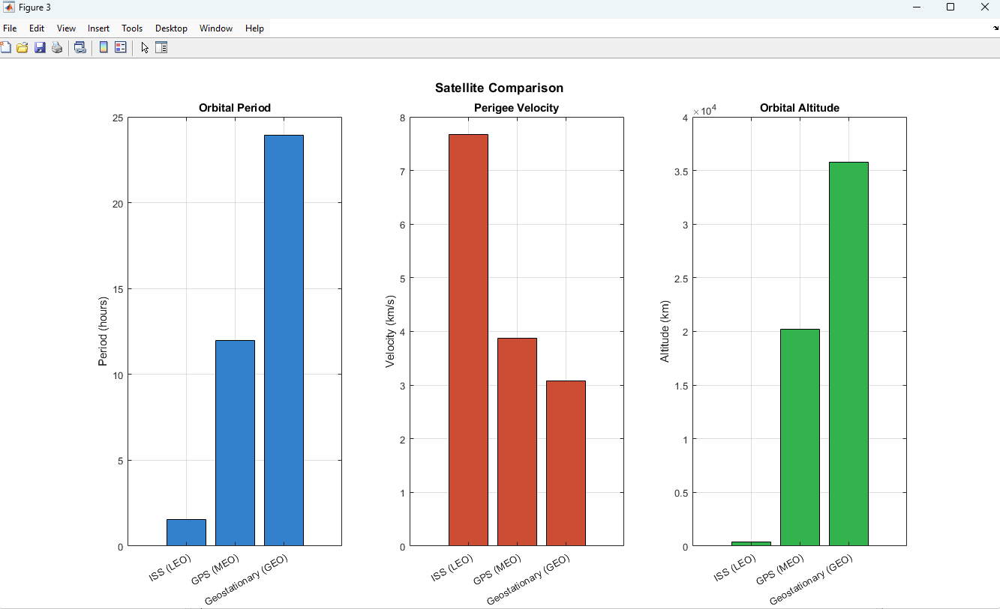

# Orbital Mechanics Simulator — Kepler's Laws

MATLAB simulation of elliptical orbits using Kepler's laws and the vis-viva equation. Compares ISS, GPS, and Geostationary satellites.

## Preview




## Files
- [`KelperOrbital.m`](KelperOrbital.m) — main MATLAB script
- [`KelperFigure1.png`](KelperFigure1.png) — orbital paths to scale
- [`KelperFigure2.png`](KelperFigure2.png) — velocity vs true anomaly
- [`KelperFigure3.png`](KelperFigure3.png) — comparative bar charts

## Satellites analyzed
| Satellite | Altitude (km) | Period (hrs) | v_perigee (km/s) |
|-----------|--------------|--------------|-----------------|
| ISS (LEO) | 408 | 1.54 | 7.667 |
| GPS (MEO) | 20,180 | 11.97 | 3.874 |
| GEO | 35,786 | 24.00 | 3.075 |

## Theory
Vis-viva equation: v = √(GM(2/r - 1/a))

Orbital period: T = 2π√(a³/GM)

Eccentricity: e = (r_a - r_p)/(r_a + r_p)

## How to run
```matlab
% Run KelperOrbital.m
% Modify satellites cell array to simulate different orbits
```

## Tools
MATLAB R2024a

## Skills demonstrated
Orbital mechanics • Kepler's laws • Vis-viva equation • Numerical simulation • MATLAB • Aerospace engineering
