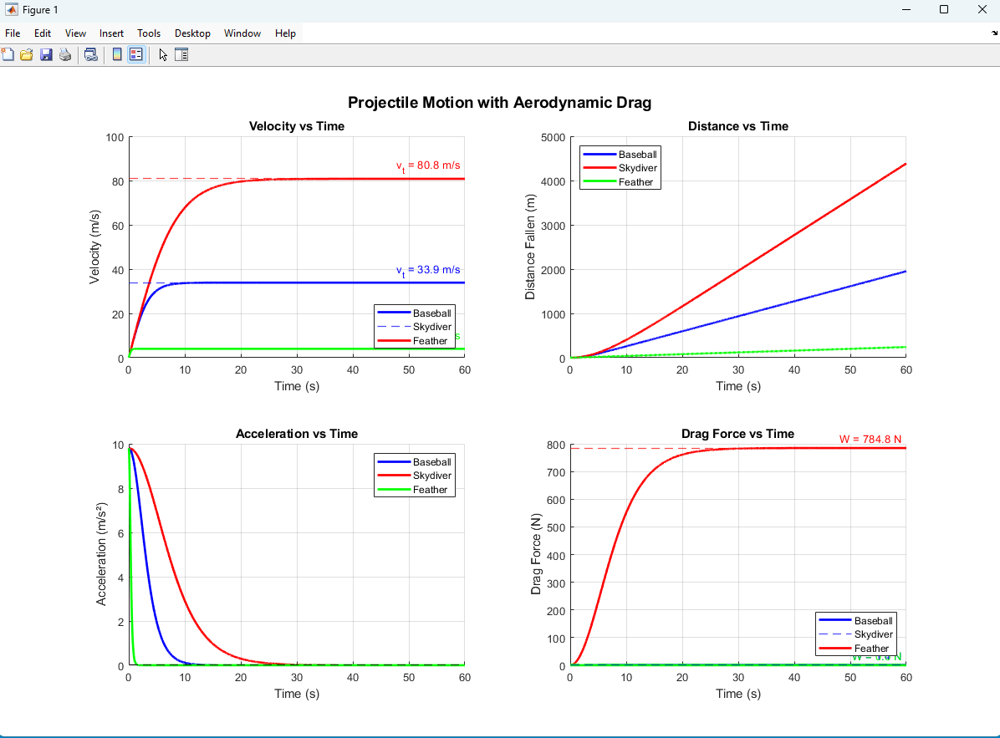
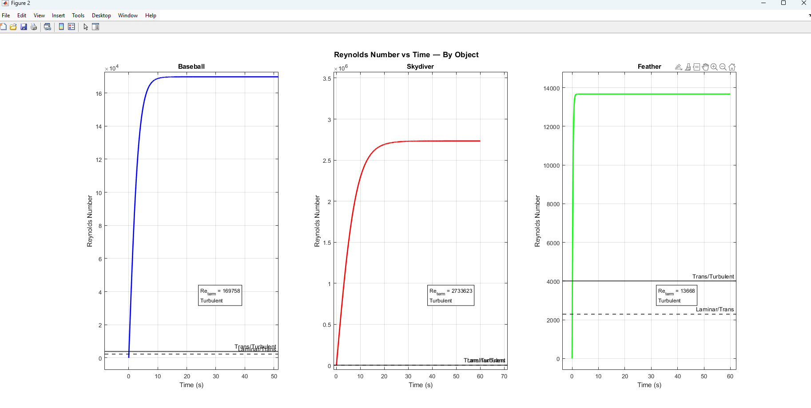

# Projectile Motion with Aerodynamic Drag

MATLAB simulation of free-fall with aerodynamic drag for three objects. Analyzes terminal velocity, Reynolds number, and flow regime.

## Preview



## Files
- [`Projectile_Drag.m`](Projectile_Drag.m) — main MATLAB script
- [`DragFigure1.png`](DragFigure1.png) — velocity, distance, acceleration, drag force
- [`DragFigure2.png`](DragFigure2.png) — Reynolds number per object

## Objects simulated
| Object | Mass (kg) | Diameter (m) | Cd |
|--------|-----------|--------------|-----|
| Baseball | 0.145 | 0.074 | 0.47 |
| Skydiver | 80 | 0.50 | 1.00 |
| Feather | 0.003 | 0.05 | 1.50 |

## Theory
Drag force: F = ½ρCdAv²

Terminal velocity: v_t = √(2mg/ρCdA)

Reynolds number: Re = ρvD/μ

Numerical integration using Euler method.

## How to run
```matlab
% Run Projectile_Drag.m
% Modify the objects cell array to simulate different objects
```

## Tools
MATLAB R2024a

## Skills demonstrated
Fluid mechanics • Drag analysis • Terminal velocity • Reynolds number • Euler numerical integration • MATLAB
